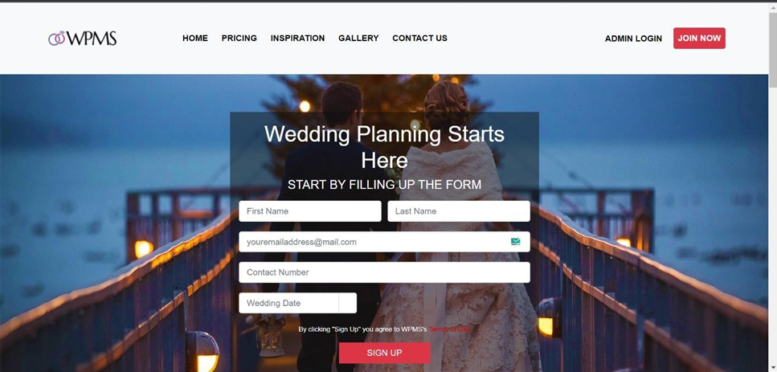
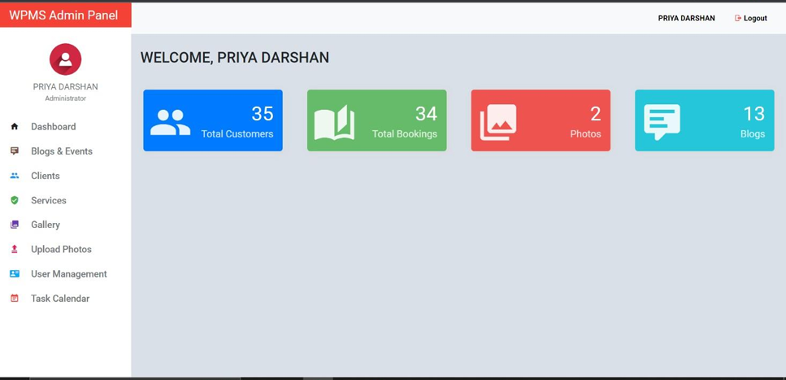
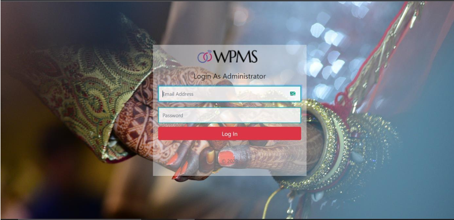
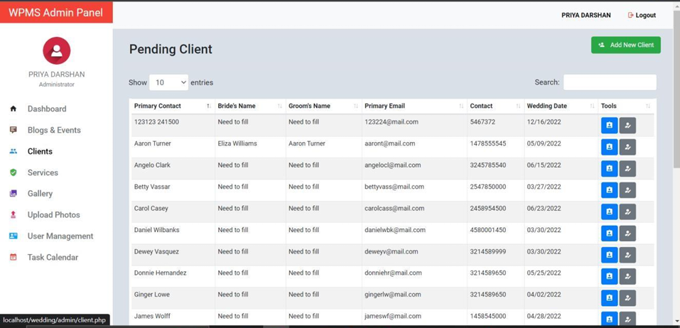
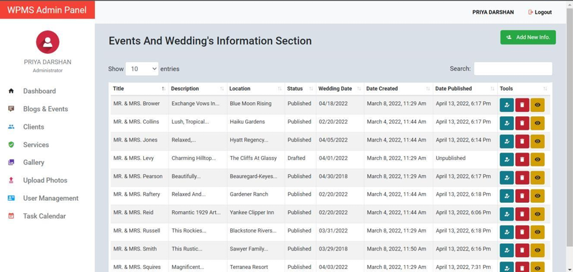
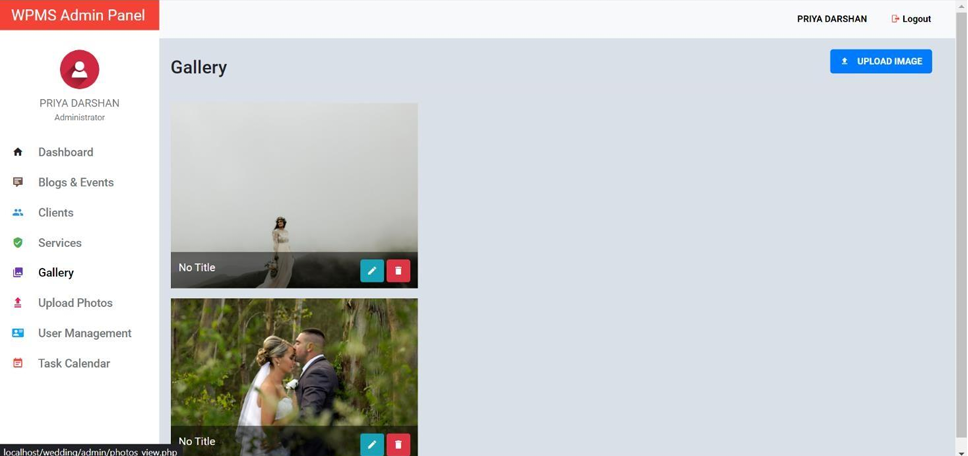
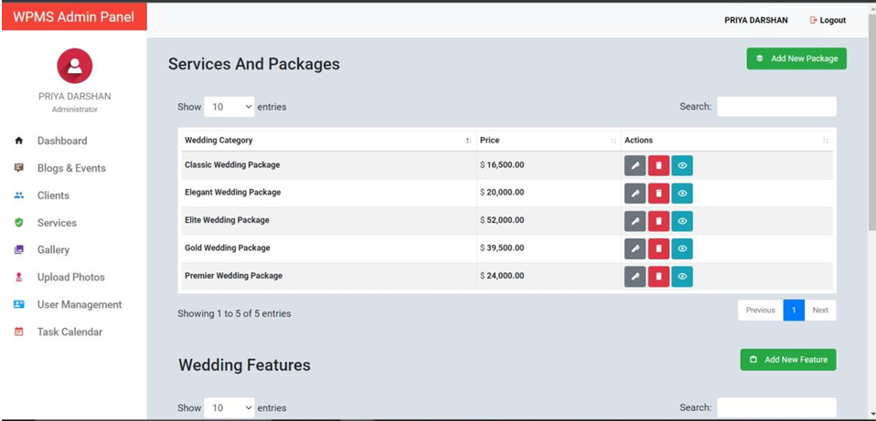
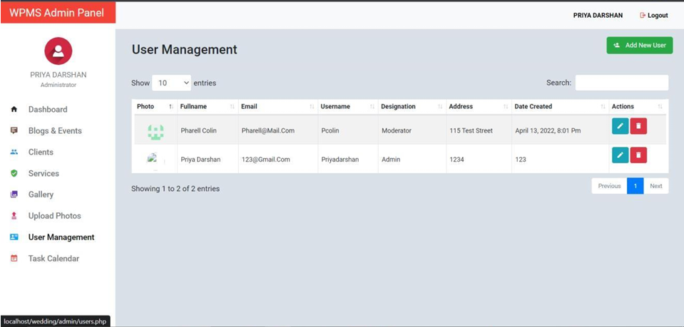

# Wedding Management System
Welcome to the **Wedding Management System**! This project provides an all-in-one platform for planning and managing weddings efficiently. Designed for couples, vendors, and planners, it streamlines the entire process with an easy-to-use web-based solution.

---

## 🚀 Features

### For Couples:
- Access a wide range of wedding services and vendors.
- Customize wedding designs, themes, and plans.
- Manage guest lists and event schedules effortlessly.

### For Vendors:
- Showcase products and services to a larger audience.
- Gain recognition and increase client base.
- Manage bookings and communication effectively.

### For Planners:
- Assist in coordinating between couples and vendors.
- Simplify task management and ensure smooth execution.

---

## 🛠️ Technologies Used

- **Frontend**: HTML, CSS, Bootstrap
- **Backend**: PHP
- **Database**: MySQL
- **Server**: XAMPP

---

## 🎨 Highlights

1. **User-Friendly Interface**:
   - Intuitive navigation and clear layouts make it easy for users to access features.

2. **Comprehensive Planning Tools**:
   - Organize and track all wedding-related tasks in one place.

3. **Secure and Reliable**:
   - Ensures data security with robust authentication mechanisms.

---

## 📂 Project Structure

- **Login System**: Secure access for admins and users.
- **Admin Dashboard**: Manage users, bookings, and services efficiently.
- **Client Pages**: A tailored interface for couples to plan their dream weddings.
- **Vendor Pages**: Empower vendors to promote their services.
- **Dynamic Pricing and Packages**: Customizable offerings based on client preferences.
- **Gallery**: Showcase events and completed projects.

---

## 🔍 How to Use

1. Clone the repository and set up the environment using XAMPP.
2. Import the database schema provided.
3. Access the application via a web browser and start managing your wedding tasks.

---

## 📸 Screenshots

### Login Page  
  

### Admin Dashboard  
  

### Admin Login Page  
  

### Client Management  
  

### Event Page  
  

### Gallery  
  

### Services and Packages  
  

### User Management Page  
  

---
